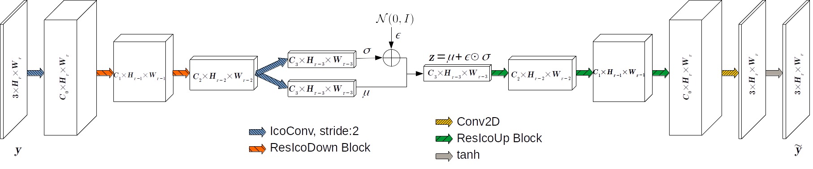

# GenIcoNet
### Generative Icosahedral Mesh Convolutional Network
In this work, we propose a generative icosahedral mesh convolutional network (GenIcoNet) that learns data distribution of surface meshes. Our end-to-end trainable network learns semantic representations using 2D convolutional filters on the regularized icosahedral meshes. The conference paper can be found [here](https://www.researchgate.net/publication/355034606_GenIcoNet_Generative_Icosahedral_Mesh_Convolutional_Network).



## Summary
In order to train a generative network for a CAD dataset, following steps need to be carried out:
- CAD to manifold mesh conversion
- Spherical parameterization of the surface meshes
- Regularization of the meshes to icosahedral grid
- Convert data to numpy arrays for faster training
- Training the GenIcoNet
- Evalute GenIcoNet using Dash Application 
## Usage
#### Download
```
git clone https://github.com/hrdkjain/Matlab-Functions.git
git clone https://github.com/hrdkjain/CAD2Mesh.git
git clone https://github.com/hrdkjain/IcosahedralMapping.git
git clone https://github.com/hrdkjain/IcosahedralCNN.git
git clone https://github.com/hrdkjain/PythonFunctions.git
git clone https://github.com/hrdkjain/GenIcoNet.git
```
This downloads all the dependencies in the same folder as the GenIcoNet.
### 1. CAD2Mesh Conversion
`CAD2Mesh` contains Matlab code for the conversion of CAD models to manifold meshes.

### 2. Spherical Parameterization
This works uses Advanced Hierarchical Spherical Parameterization Alogorithm for parameterization, authors implementation can be downloaded from [here](http://staff.ustc.edu.cn/~fuxm/projects/AHSP/index.html).

### 3. Regularization
`IcosahedralMapping` contains Matlab code for regularizing mesh to icosahedral grid using parameterized representation

### 4. Data Format Conversion

#### 4.1 Build Docker Deploy Image
```yaml
docker build --network=host \
  --build-arg USER_ID=$(id -u) \
  --build-arg GROUP_ID=$(id -g) \
  --build-arg USER=docker_$USER \
  -t githubgeniconetdocker:v1 . 
```
#### 4.2 Run Docker Image
```yaml
docker run --network host \
  --gpus all -it --rm --user $(id -u):$(id -g) \
  --shm-size=8G \
  -e HOST_HOSTNAME=`hostname` \
  --mount type=bind,src=<>,dst=<> \
  --workdir <> githubgeniconetdocker:v1 bash
```
#### 4.3 Generate .npz files from .mat files
```yaml
python3 generate.py \
--data_dir=<Path to manifold mesh generated from CAD2Mesh> \
--samp_weights_dir=<Path to regularized mapping .mat files> \
--out_dir=<Path to save the processed numpy files>
```
Additional input arguments like `--normalization_mode`, `--nested_dir` and `--subdivision` can be passed to `generate.py`
### Dataset Download (skipping steps 1-2-3-4)
Alternatively the pre-processed ModelNet10 dataset (`.npz` files) used in this work can be downloaded from [here]().

### 5. Train GenIcoNet on ModelNet10 dataset
```yaml
python3 run.py --model ico2ico --process train --data_instance trn --batch_size 36 \
--dataPth /home/user/Dataset/ModelNet10/V128A_AHSO_I5 --train_epoch 700\
--logDir log/ae_test

python3 run.py --model ico2ico_vae --process train --data_instance trn --batch_size 36 \
--dataPth /home/user/Dataset/ModelNet10/V128A_AHSO_I5 --train_epoch 600\
--logDir log/vae_test
```
### 6. Evaluate the trained GenIcoNet
```yaml
python3 run.py --model ico2ico --process test --data_instance val --batch_size 36 \
--dataPth /home/user/Dataset/ModelNet10/V128A_AHSO_I5 \
--logDir log/ae --write_output_mesh

python3 run.py --model ico2ico_vae --process test --data_instance val --batch_size 36 \
--dataPth /home/user/Dataset/ModelNet10/V128A_AHSO_I5 \
--logDir log/vae --write_output_mesh
```
The above command uses the last best model for testing. Additional options can be found in `run.py`

### 7. Visualize Generative Behaviour of GenIcoNet
Alternatively, this project also contains trained models (in `log/` dir) for both the architectures of GenIcoNet and pre-processed [dataset](). This should be enough to reproduce the results shown in the paper.
```yaml
python3 app.py --logDir log/ae --model ico2ico --dataPth /home/user/Dataset/ModelNet10/V128A_AHSO_I5

python3 app.py --logDir log/vae --model ico2ico_vae --dataPth /home/user/Dataset/ModelNet10/V128A_AHSO_I5
```
Open `http://127.0.0.1:8050/` in your favourite browser, this will launch the dash application for mesh visualization.
Select model and epochs in the left top and click `Load Model & Files`.
Nearest neighbor based operations specified in the paper requires computing pca, which can be done by clicking the `pca` option in Mesh Interpolation.

## Citation
If you find this project useful in your work, please consider citing:

    @inproceedings{Jain2021GenIcoNet,
      title={GenIcoNet: Generative Icosahedral Mesh Convolutional Network},
      author={Jain, Hardik and Hellwich, Olaf},
      booktitle={International conference on 3D Vision},
      year={2021}
    }